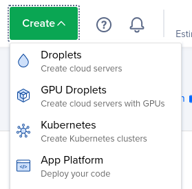
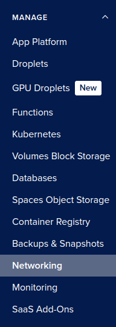

# Deploying tools to the web

Individual tools should have instructions for their deployment, where relevant. This is 
an overview of the various tech and platforms we use to deploy web-based tools.

## Docker

The [seroanalytics Dockerhub organisation](https://hub.docker.com/u/seroanalytics)
is provided for free by Docker under the [Docker-Sponsored Open Source Program](https://docs.docker.com/trusted-content/dsos-program/).
To create new repositories or push images you will need a Docker Hub user account, and then to be added to the 
organisation by an existing member.

## Github pages

For purely static websites (sites that run entirely in the browser, using HTML/CSS/JS) you 
can use Github pages. See the [official docs](https://pages.github.com/) for guidance. Because [seroanalytics.github.io](https://github.com/seroanalytics/seroanalytics.github.io) is 
configured to use our custom domain, [seroanalytics.org](https://seroanlytics.org), a repo configured to use 
GH pages will have its website available at `seroanalytics.org/reponame`.

## DigitalOcean

### Hosting

For apps that require a back-end (e.g. RShiny or plumber apps), we use DigitalOcean's App Platform. 
This is a platform as a service that can be configured by connecting a Github repo that contains the source code, or
by referencing a Docker image. 

To set up a new app:

1. Log in to DigitalOcean and use the left-hand "Manage" toolbar or the top "Create" dropdown to navigate to the App Platform.
    
2. Select Github or Docker Hub as your source, depending on whether the app is Dockerised or not.
3. Use the wizard to complete the setup.
4. If you're building your app directly from the source code, changes to the Github source will rebuild the app
   automatically.

   If you're using Docker Hub as a source, pushes of new images **will not** trigger an automatic deploy. To
   set up automatic deploys in this case you will need to use a Github action to update the configured image tag, which will trigger a re-deploy using the new tag. See
[this action](https://github.com/seroanalytics/seroviz/blob/main/.github/workflows/deploy.yaml) as an example.

DigitalOcean apps can contain multiple services (e.g. a front-end and a back-end). See [seroviz](https://github.com/seroanalytics/seroviz) for an example of this.

### DNS

We also use DigitalOcean to manage DNS for `seroanalytics.org`. To add or change DNS records, you will need to be a member 
of the `seroanalytics` team on DigitalOcean - ask an existing member to add you. DNS is managed via the "Networking" tab on the left-hand
menu:

## Namecheap

The domain `seroanalytics.org` is registered with Namecheap under Alex's account.
